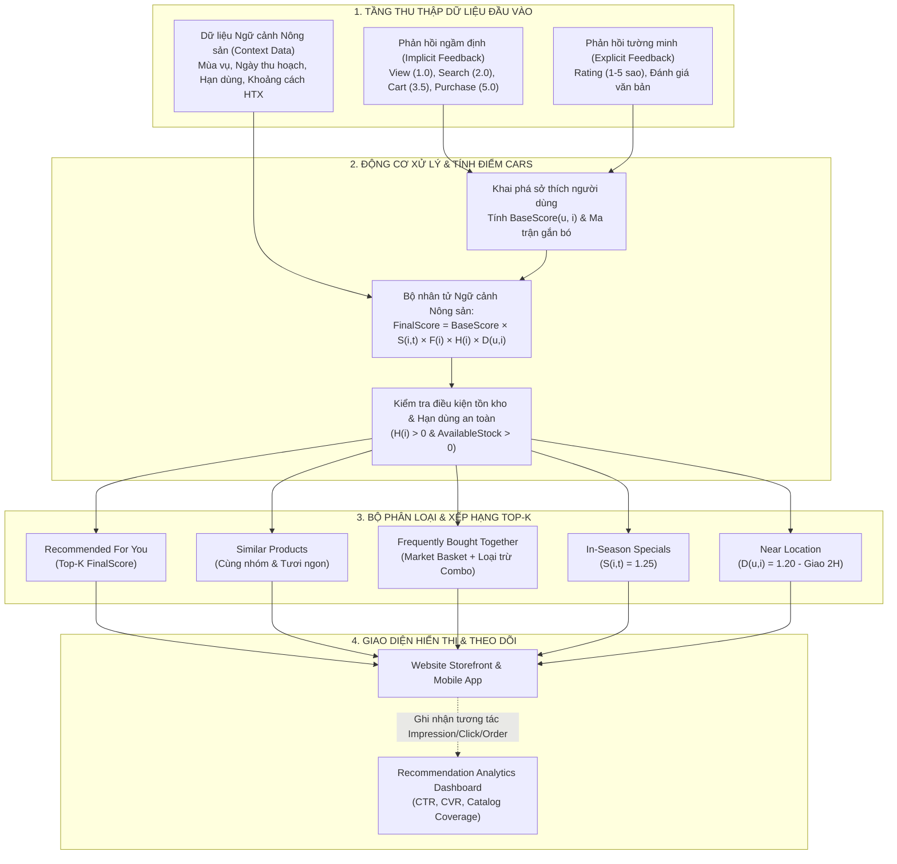
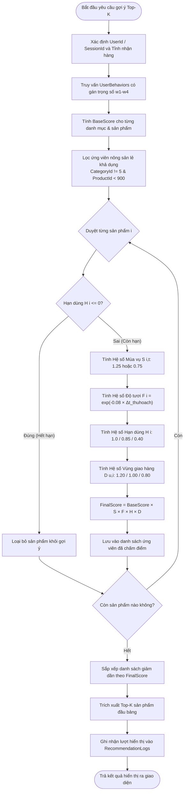
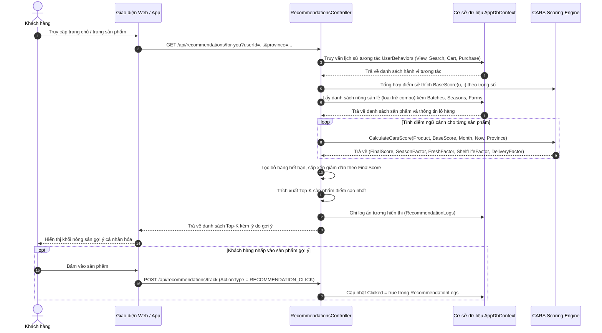
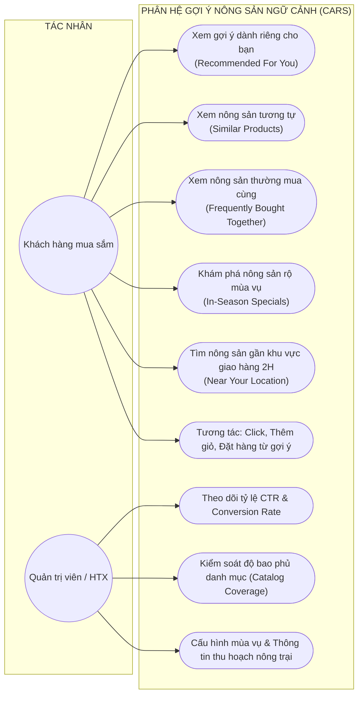

# THUẬT TOÁN GỢI Ý TOP-K NÔNG SẢN THEO NGỮ CẢNH (CONTEXT-AWARE RECOMMENDER SYSTEM - CARS)

---

## 1. TỔNG QUAN HỆ THỐNG GỢI Ý TRONG THƯƠNG MẠI ĐIỆN TỬ NÔNG SẢN

Trong thương mại điện tử nông sản, các phương pháp gợi ý truyền thống như **Lọc cộng tác (Collaborative Filtering - CF)** hay **Lọc theo nội dung (Content-based Filtering - CB)** bộc lộ nhiều hạn chế nghiêm trọng do không xét tới các đặc thù vật lý của hàng hóa tươi sống:
- Nông sản là mặt hàng có **hạn sử dụng rất ngắn**, chất lượng suy giảm nhanh chóng theo từng giờ sau thu hoạch.
- Tính **mùa vụ khắt khe**: Một loại trái cây dù được người dùng cực kỳ yêu thích trong quá khứ nhưng nếu đang trái mùa thì chất lượng sẽ kém, giá thành đắt và dễ ngậm chất bảo quản.
- Tính **nhạy cảm về cự ly vận chuyển**: Nông sản rau củ tươi dễ dập nát, héo úa nếu phải vận chuyển liên tỉnh dài ngày; ưu tiên tối đa việc kết nối người mua với Hợp tác xã/Nông trại lân cận để giao hỏa tốc 2 giờ.

Để giải quyết bài toán trên, hệ thống triển khai mô hình **Hệ thống gợi ý nhận biết ngữ cảnh (Context-Aware Recommender System - CARS)** kết hợp thuật toán xếp hạng Top-K chuyên biệt cho nông sản sạch.

---

## 2. THU THẬP VÀ MÔ HÌNH HÓA DỮ LIỆU HÀNH VI (FEEDBACK MINING)

Hệ thống kết hợp cả hai luồng thông tin:

### 2.1. Phản hồi ngầm định (Implicit Feedback)
Người dùng thường ít khi chủ động đánh giá hoặc để lại nhận xét, nhưng mọi thao tác duyệt web đều phản ánh mức độ quan tâm. Hệ thống tự động ghi nhận các sự kiện vào bảng `UserBehaviors` và gán trọng số tương ứng:

$$\text{ActionWeight}(a) = \begin{cases} 
1.0 & \text{với hành động Xem sản phẩm (VIEW)} \\
1.5 & \text{với hành động Xem nhanh (QUICK\_VIEW)} \\
2.0 & \text{với hành động Tìm kiếm từ khóa (SEARCH)} \\
3.5 & \text{với hành động Thêm vào giỏ hàng (CART)} \\
5.0 & \text{với hành vi Đặt mua thành công (PURCHASE)}
\end{cases}$$

Điểm gắn bó của người dùng $u$ đối với danh mục hàng $c$ được tổng hợp theo thời gian:
$$\text{Affinity}(u, c) = \sum_{b \in \text{Behaviors}(u, c)} \text{ActionWeight}(b)$$

### 2.2. Phản hồi tường minh (Explicit Feedback)
Điểm đánh giá chất lượng từ 1 đến 5 sao (`Rating`) và phản hồi văn bản sau khi hoàn thành đơn hàng, được lưu trong bảng `Reviews`. Sản phẩm có điểm trung bình $\ge 4.5$ sao được tạo lợi thế trong giai đoạn khởi động lạnh (Cold Start).

---

## 3. MÔ HÌNH HÀM CHẤM ĐIỂM ĐA NHÂN TỐ NGỮ CẢNH (CARS SCORING FUNCTION)

Điểm phù hợp tổng thể của sản phẩm $i$ đối với khách hàng $u$ trong ngữ cảnh thời gian và không gian $C$ được tính theo công thức tích hợp đa nhân tố:

$$\mathbf{FinalScore}(u, i, C) = \mathbf{BaseScore}(u, i) \times \mathbf{S}(i, t) \times \mathbf{F}(i) \times \mathbf{H}(i) \times \mathbf{D}(u, i)$$

Trong đó:

### 3.1. Điểm sở thích cơ bản: $\mathbf{BaseScore}(u, i)$
- Chuẩn hóa trong khoảng $[0.70, 1.00]$.
- Với người dùng đã có lịch sử tương tác:
  $$\text{BaseScore}(u, i) = 0.80 + 0.18 \times \frac{\text{Affinity}(u, \text{Category}_i)}{\max_{c} \text{Affinity}(u, c)}$$
- Với người dùng mới (Cold Start):
  $$\text{BaseScore}(u, i) = 0.75 + 0.05 \times \frac{\text{AverageRating}_i - 3.0}{2.0}$$

### 3.2. Hệ số Mùa vụ: $\mathbf{S}(i, t)$ (Seasonality Factor)
Tra cứu theo bảng `ProductSeasons` đối chiếu với tháng hiện tại $t \in [1, 12]$:
$$\mathbf{S}(i, t) = \begin{cases} 
1.25 & \text{nếu } t \text{ thuộc khoảng [StartMonth, EndMonth] (Đúng chính vụ - Thơm ngon, rẻ nhất)} \\
0.75 & \text{nếu } t \text{ nằm ngoài mùa vụ (Trái vụ - Hạn chế ưu tiên)} \\
1.00 & \text{nếu nông sản canh tác nhà màng/quanh năm}
\end{cases}$$

### 3.3. Hệ số Độ tươi: $\mathbf{F}(i)$ (Freshness Factor)
Ứng dụng **Hàm suy giảm mũ (Exponential Decay)** dựa trên khoảng thời gian từ ngày thu hoạch (`HarvestDate`) của lô hàng đến thời điểm hiện tại:
$$\mathbf{F}(i) = \exp\left(-\lambda \times \Delta t_{\text{thuhoach}}\right)$$
- $\Delta t_{\text{thuhoach}}$: Số ngày kể từ khi thu hoạch ($\Delta t \ge 0$).
- $\lambda = 0.08$: Hệ số phân rã chất lượng theo ngày của nông sản hữu cơ.
- **Ý nghĩa**:
  - Hái trong ngày ($\Delta t = 0$): $F = 1.000$ (Độ tươi tối đa).
  - Sau 1 ngày ($\Delta t = 1$): $F \approx 0.923$.
  - Sau 3 ngày ($\Delta t = 3$): $F \approx 0.787$.
  - Sau 7 ngày ($\Delta t = 7$): $F \approx 0.571$.

### 3.4. Hệ số Hạn sử dụng: $\mathbf{H}(i)$ (Shelf-life Factor)
Đo lường thời gian sử dụng an toàn còn lại so với ngày hết hạn (`ExpiryDate`):
$$\mathbf{H}(i) = \begin{cases} 
0.00 & \text{nếu } \Delta t_{\text{exp}} \le 0 \text{ (Đã hết hạn - LẬP TỨC LOẠI BỎ KHỎI GỢI Ý)} \\
0.40 & \text{nếu } 0 < \Delta t_{\text{exp}} \le 2 \text{ ngày (Cận date nguy hiểm - Giảm mạnh điểm)} \\
0.85 & \text{nếu } 2 < \Delta t_{\text{exp}} \le 4 \text{ ngày (Tiêu chuẩn)} \\
1.00 & \text{nếu } \Delta t_{\text{exp}} \ge 5 \text{ ngày (Rất an toàn, lưu trữ tốt)}
\end{cases}$$

### 3.5. Hệ số Khoảng cách & Vùng giao hàng: $\mathbf{D}(u, i)$ (Delivery Proximity Factor)
Đối chiếu giữa vị trí địa lý của Nông trại/Hợp tác xã (`Farms.Province`) và Tỉnh/Thành phố nhận hàng của người dùng:
$$\mathbf{D}(u, i) = \begin{cases} 
1.20 & \text{nếu Cùng tỉnh/thành phố (Hỗ trợ giao hỏa tốc trong 2 giờ, rau giữ nguyên độ tươi)} \\
1.00 & \text{nếu Tỉnh lân cận trong cùng khu vực kinh tế (Giao trong ngày)} \\
0.80 & \text{nếu Khác vùng miền / Khoảng cách xa (Thời gian giao lâu, phát sinh phí bảo quản lạnh)}
\end{cases}$$

---

## 4. CHI TIẾT 5 NHÓM GỢI Ý TOP-K

1. **Gợi ý dành riêng cho bạn (`Recommended For You`)**:
   - Vị trí: Trang chủ và Dashboard cá nhân.
   - Cơ chế: Quét toàn bộ danh mục nông sản lẻ khả dụng, tính toán toàn diện $\text{FinalScore}(u, i, C)$, sắp xếp giảm dần và lấy ra Top-$K$ sản phẩm cao nhất.

2. **Sản phẩm tương tự (`Similar Products`)**:
   - Vị trí: Trang chi tiết sản phẩm.
   - Cơ chế: Lọc các mặt hàng cùng danh mục (Category) hoặc cùng tiêu chuẩn VietGAP/GlobalGAP, sau đó tái xếp hạng theo Độ tươi $F(i)$ và Mùa vụ $S(i, t)$.

3. **Thường được mua cùng (`Frequently Bought Together`)**:
   - Vị trí: Trang chi tiết sản phẩm và Giỏ hàng.
   - Cơ chế: 
     - **Market Basket Analysis (Luật kết hợp)**: Quét lịch sử bảng `OrderItems` để tìm các sản phẩm đồng xuất hiện trong cùng đơn hàng.
     - **Session Co-occurrence**: Quét các phiên duyệt web cùng thêm vào giỏ.
     - **Đa dạng hóa danh mục (Category Diversity Re-ranking)**: Sắp xếp xen kẽ 2 món khác danh mục (đồ nấu kèm, gia vị, quả tráng miệng) + 1 món cùng danh mục để kích thích tăng giá trị đơn hàng trung bình (AOV).
     - **Bộ lọc loại trừ Combo**: Tuyệt đối không gợi ý các gói combo lớn (trị giá cao, định kỳ) làm món mua kèm cho một loại nông sản lẻ.

4. **Nông sản đang vào mùa (`In-Season Specials`)**:
   - Vị trí: Banner trang chủ và Trang sự kiện mùa vụ.
   - Cơ chế: Lọc các nông sản có hệ số mùa vụ $S(i, t) = 1.25$ và sắp xếp ưu tiên theo độ tươi thu hoạch mới nhất.

5. **Nông sản gần khu vực giao hàng (`Near Your Location`)**:
   - Vị trí: Trang chủ và Bộ lọc giao nhanh.
   - Cơ chế: Lọc các sản phẩm thuộc nông trại có cự ly gần ($D(u, i) = 1.20$), đáp ứng cam kết giao hỏa tốc trong 2 giờ.

---

## 5. DASHBOARD THEO DÕI VÀ ĐÁNH GIÁ HIỆU QUẢ

Hệ thống ghi nhận mọi lượt hiển thị và hành vi tương tác vào bảng `RecommendationLogs` với 3 chỉ số cốt lõi:

1. **Tỷ lệ nhấp (Click-Through Rate - CTR)**:
   $$\text{CTR} = \frac{\text{Tổng số lượt nhấp vào gợi ý}}{\text{Tổng số lượt hiển thị gợi ý (Impressions)}} \times 100\%$$

2. **Tỷ lệ chuyển đổi mua hàng (Conversion Rate - CVR)**:
   $$\text{CVR} = \frac{\text{Số lượt đặt hàng thành công từ gợi ý}}{\text{Tổng số lượt nhấp vào gợi ý}} \times 100\%$$

3. **Độ bao phủ danh mục (Catalog Coverage)**:
   $$\text{Catalog Coverage} = \frac{|\{i \in \text{Products} \mid i \text{ đã từng được đưa vào gợi ý}\}|}{|\text{Tổng số sản phẩm đang kinh doanh}|} \times 100\%$$
   *Ý nghĩa: Chứng minh thuật toán công bằng, phân bổ cơ hội bán hàng cho nhiều nông dân và hợp tác xã khác nhau, không chỉ dồn vào vài sản phẩm bán chạy nhất.*

---

## 6. CÁC SƠ ĐỒ THIẾT KẾ THUẬT TOÁN (DÙNG ĐỂ CHÈN VÀO WORD)

> **Hướng dẫn sử dụng**: Bạn có thể sao chép trực tiếp các đoạn mã `mermaid` dưới đây vào [Mermaid Live Editor](https://mermaid.live) hoặc công cụ Word (hỗ trợ Mermaid Plugin/Markdown) để xuất ảnh PNG/SVG có độ phân giải cao phục vụ thuyết minh đồ án.

### SƠ ĐỒ 1: KIẾN TRÚC TỔNG THỂ MÔ HÌNH CARS (ARCHITECTURE DIAGRAM)

---

### SƠ ĐỒ 2: SƠ ĐỒ HOẠT ĐỘNG TÍNH ĐIỂM NGỮ CẢNH (ACTIVITY DIAGRAM)

---

### SƠ ĐỒ 3: SƠ ĐỒ TUẦN TỰ QUÁ TRÌNH GỢI Ý (SEQUENCE DIAGRAM)

---

### SƠ ĐỒ 4: SƠ ĐỒ CA SỬ DỤNG PHÂN HỆ GỢI Ý (USE CASE DIAGRAM)

